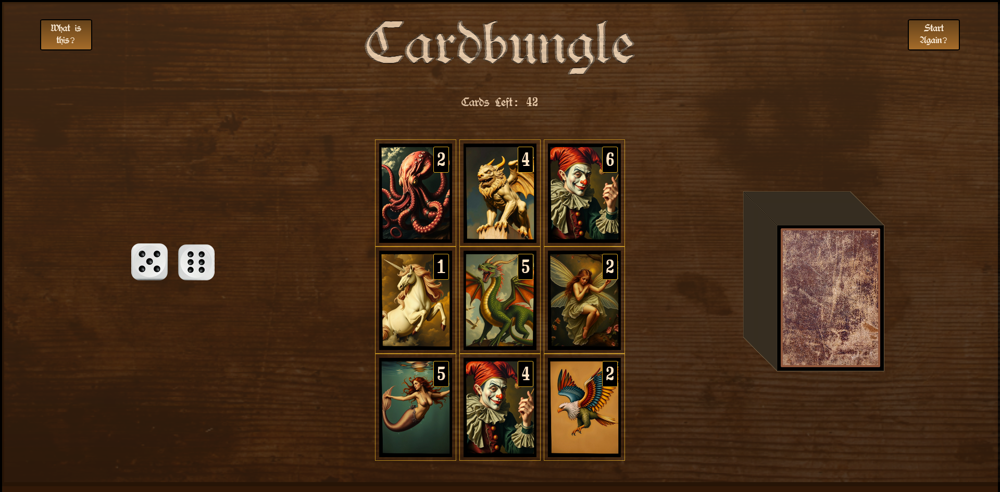

# Cardbungle Card / Dice Game

Work in Progress

---

Cardbungle is a proof of concept card / dice game.

The player can take cards from a shuffled deck and place them on the grid board.

Using the dice, the player can change the value of any card.

When the player selects two cards from the same suit AND with the same value, the cards will disappear in a puff of smoke.

The objective of the game is to get rid of all the cards in the deck.

    

Future plans:

- [ ] Have the user click the start button first. This is needed to initialize audio for browsers.
- [ ] Add more intuitive controls. Instead of click dragging, the user can select with a click and it anchors elements to the cursor.
- [ ] Visually animated win celebration. Coins and Carbuncle gems falling on the screen in a matrix rain code aesthetic.
- [ ] Refactor codebase. Improve document flow and readability.

Bug Report:

There is on occasion that ability to duplicate the cards into the deck. It appears to be happening when the cards are not properly placed on the board and return to the deck. When I have the time and most likely when i refactor the codebase, I will build a test and run through to check. The refactoring might even turn into a rebuild and use more object-oriented approach for the entire program.
